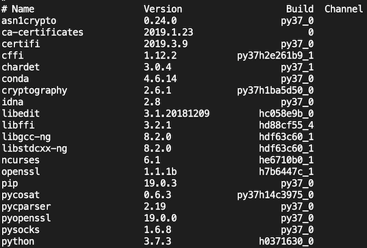
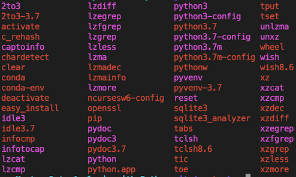

# Conda Utilities

Once Conda is installed in your system, you can use basic commands to get information about the installed version on your system or upadate the current version.

## Conda version

Verify that conda is installed and running on your system by typing:

```console
$ conda --version
conda 4.7.12
```
Conda displays the number of the version that you have installed.

## Updating conda
To update conda to the current version, type the following:

```console
$ conda update conda  
```

Conda compares versions and then displays what is available to install.
If a newer version of conda is available, type `y` to update:

```console
Proceed ([y]/n)? y
```

The packages that come with the initial install tend to be out of date, so updating them now will prevent future errors from out of date software.

## Listing packages installed

You can check out your own install by entering `conda list` into your terminal. This command will return the name, version, build number and channel for each package currently installed.



This is a list of all packages installed with the default Miniconda distribution. Notice that python is considered a package.


## The PATH

All operating systems have something called a PATH which is a list of directories that the operating system looks through in order to find executable programs. The directories in Windows paths are separated by a semi-colon, while macOS and Linux directories are separated by a colon. Let’s take a look at the path now.

- Windows users: `echo %PATH%`
- macOS/Linux: `$ echo $PATH`

All operating systems should have the following two directories in their path that end with the following.

- `/opt/anaconda3/bin`
- `/opt/anaconda3/condabin`

It is the executable programs within these folders that are available for us to use on the command line. Listing out these programs on my macOS machine yields the following:

```console
$ ls /opt/anaconda3/bin
```



### A note on the PATH and base environment

By default, Anaconda creates an environment with the name **base** that has all the packages displayed from conda list installed. The string '**(base)**' is usually prepended to the prompt to indicate that this environment is **active**. When an environment is active, it means that your python code will be interpreted by the python executable in that environment. Let's verify this by starting a python interpreter by running the command `python`.

```console
(base)$ python
...
>>> import sys
>>> sys.executable
'/opt/anaconda3/bin/python'
```

We can verify that it is running the executable by importing the `sys` library and fetching the `executable` attribute. To exit the interpreter run the command `exit()` or hit `control` + `D`.

## Conda information

To display all information about your conda installation type in your Terminal or Anaconda Prompt:

```console
(base)~$ conda info -a
```
In the console you will see information about the current conda installation, such as:

```console
 active environment: base
active env location: /opt/anaconda3
      conda version: 4.7.12
     python version: 3.7.4.final.0
```

## Viewing command-line help

In the next sections we will go through the basic commands of `conda` to mange packages and create environments. You can always refer to the Command help reference on the  documentation page [here](https://conda.io/projects/conda/en/latest/commands.html). However, a quick access to a list of the supported commands of your `conda` installed version is directly available in your Terminal or Anaconda Prompt by running the following command:

```console
(base)~$ conda -h
```

The `-h` or `--help` will list all the available commands using conda. To get help for a specific command, type the command name followed by `-h`. For example, to see help for the `create` command, that we will see in the Managing Environment section, type:

```console
(base)~$ conda create -h
```
