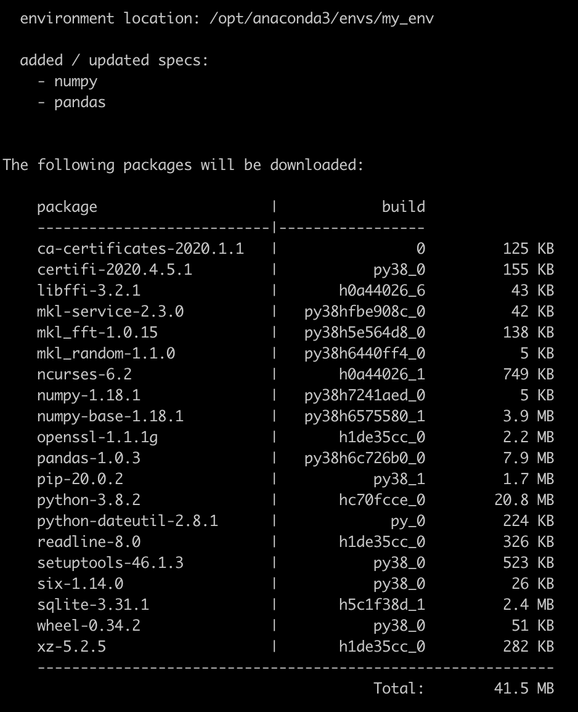
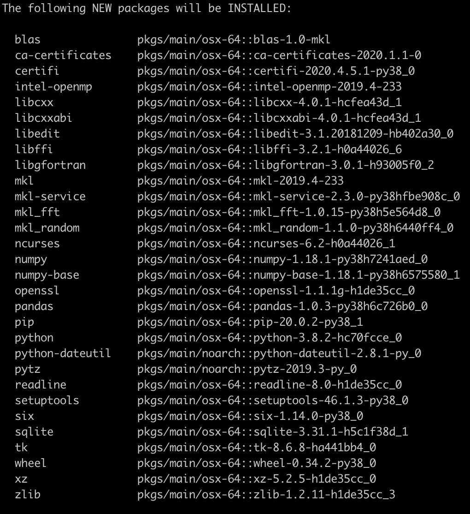
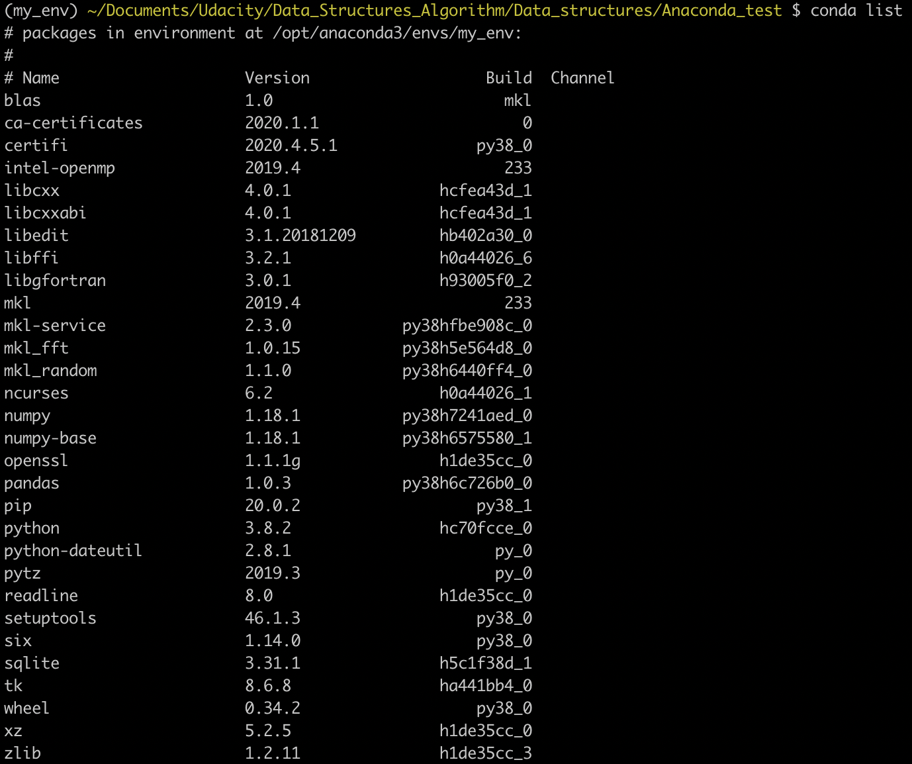
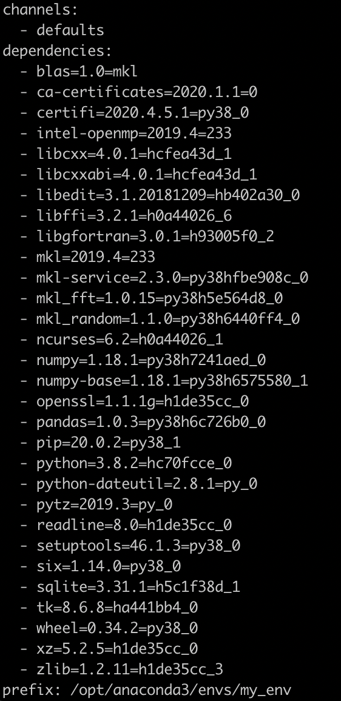

# Environment conda commands

In this lesson we'll introduce the following commands to manage separate environments.

1. [Create a new environment and install packages in it](#Create-a-new-environment-and-install-packages-in-it)
2. [Listing environments](#Listing-environments)
3. [Entering an environment](#Entering-an-environment)
4. [Listing packages in an active environment](#Listing-packages-in-an-active-environment)
5. [Saving environments](#Saving-environments)
6. [Exporting an environment file across platforms](#Exporting-an-environment-file-across-platforms)
7. [Leave the current environment](#Leave-the-current-environment)
8. [Cloning an environment](#Cloning-an-environment)
9. [Removing an environment](#Removing-an-environment)
10. [Creating an environment file manually](#Creating-an-environment-file-manually)
11. [Creating an environment from an environment.yaml file](#Creating-an-environment-from-an-environment.yaml-file)
12. [Updating an environment file](#Updating-an-environment-file)
13. [Updating conda base environment](#Updating-conda-base-environment)
14. [Conda Revision](#Conda-Revision)


## Create a new environment and install packages in it

We will name the environment `my_env` and install the packages `numpy` and `pandas`. At the prompt of your terminal type:
```console
$ conda create -n my_env numpy pandas
```
Here, `-n my_env` sets the name of your environment to `my_env` (`-n` is the abbrevation for `--name`) and the two strings, `numpy` and `pandas`, are the packages (list of packages) to be installed.

It is clear that the name of the environment should somewhat describe the project we want to do and most of the times depends on the data_set used in the analysis. Therefore, replace `my_env` with the name for your environment.

<u>It's recommended to list all the packages we want to use in the environment when we create it</u>. In this way you're less likely to run into dependency conflicts since all the dependencies of those packages can be sorted out at once, compared to when we first create an environment and then simply install those libraries one by one. As a consequence, `conda` ensures dependencies are satisfied when installing packages, Python will be installed alongside `numpy` and `pandas`.

   

After running the command, Conda lists all the packages that are going to be installed and the location of the environment on your system. As you can see a **conda environment is basically a directory** that <u>contains a specific collection of conda packages that you have installed</u>. In this case the absolute path of `my_env` is `/opt/anaconda3/envs/my_env`.

   

If you haven't downloaded in your `base` environment then Conda checks to see what additional packages ("dependencies") `numpy` and `pandas` will need to be installed and asks if you want to proceed.

```console
Proceed([y]/n) ? y
```
**Note**: When you create a new environment, conda installs the latest version of `numpy` and `pandas`. As you can see the Python version in the screen is `3.8.2` and the Python version of the `base` environment is `3.7`.

To check the Python version of your active environment type `$ python --version`. If you want to use a different version of Python, for example Python 3.7, simply create a new environment and specify the version of Python that you want. For example, if you want to create a new environment with python 3.7, type: `$ conda create -n my_env python=3.7 numpy pandas`. You can also specify which version of `numpy` or `pandas` you'd like to install. For example:

```console
$ conda create -n my_env python=3.7 numpy=1.16.1
```

## Listing environments

To check if the new environment has been created successfully, you can list all the environments on your system by entering in the prompt the following commands `conda info --envs` or `conda env list`:

```console
(base)$ conda env list
# conda environments
#
base       * /opt/anaconda3
my_env       /opt/anaconda3/envs/my_env
```

A list of environments and the corresponding path appear. As you see all the environments created with Conda live by default in the `envs/` folder of your Conda directory. The *active* environment is the one with the asterisck ( * ). In this case we are still in the default environment, the environment used when we're not in one, i.e. (`base`).

Confirm its creation by finding its location in your file system at `/opt/anaconda3/envs`. Any downloads for the environment will be located here.
You can list all the enviroments created by navigating to the root of your system:

```console
(base)~$ cd /
(base)/$ cd opt/anaconda3/envs
(base) /opt/anaconda3/envs $ ls
my_env
```

**Note**: If you keep all of your environments in the `envs/` folder, you will have to give each of them a different name. If you prefer to use a different directory refer to the documentation webpage [doc specifying a location for an environment](https://conda.io/projects/conda/en/latest/user-guide/tasks/manage-environments.html#create-env-file-manually) or run the following command `conda create --help` in the Terminal. Another resource is the following article: [here](https://towardsdatascience.com/a-guide-to-conda-environments-bc6180fc533)

## Entering an environment

Once you have an environment created, use the following command to activate it:

- Windows: `conda activate my_env`
- macOS and Linux: `conda activate my_env`

**Note**: `conda activate` only works for **conda 4.6** and later versions. For conda prior 4.6 type `activate my_env` (windows) and `source activate my_env`(macOS/Linux).

When you are in the environment, you will see the environment name in front of your terminal prompt in (parentheses) or brackets. Something like `(my_env)~$`. To be sure that `my_env` has been added and is active you can use Conda to display a list of all environments.

```console
(base)~$ conda activate my_env
(my_env)~$ conda env list
# conda environments
#
base         /opt/anaconda3
my_env     * /opt/anaconda3/envs/my_env
```

## Listing packages in an active environment
The environment has only the packages needed for the project. You can check this out with `(my_env)~$ conda list`.



The results above show the name of the packages, version number, size and the channel. If the channel column has a blank value, it indicates that it has been sourced from the default channel. We will discuss about channels in the `Managing Packages` section.

## Saving environments
A really useful feature is sharing environments so others can install all the packages used in your code, with the correct versions. For example, they can recreate a test you have done. The easiest way to make your work reproducible by others is to include a file in your project’s root directory listing all the packages, along with their version numbers, that are installed in your project’s environment.

Conda calls this [environment files](https://conda.io/projects/conda/en/latest/user-guide/tasks/manage-environments.html#sharing-an-environment). They are the exact analogue of **requirements** files in Python's virtual environments (`$ pip freeze > requirements.txt`, see [example](https://towardsdatascience.com/virtual-environments-104c62d48c54#1839).). To allow them to quickly reproduce your environment, with all of its packages and versions, give them a copy of your **environment.yaml** file (see [YAML](https://yaml.org/) Ain't Markup Language), which acts like a configuration file. The contents of the file contain the name, channel(s) and packages.

You can make an **environment.yaml** file in the following way:
- First activate the environment you want to export: `(base)~$ conda activate my_env`
- Export your active environment to a new file: `(my_env)~$ conda env export > environment.yaml`. The first part `$ conda env export` writes out all the packages in the environment, including the Python version. Your **environment.yaml** file will look something like this:
   ```console
   (my_env)~$ conda env export
   name: my_env
   ```
   
   *Exported environment printed to the terminal*

Above you can see the name of the environment (`name: my_env`) and all the dependencies (along with versions) are listed. The last line (`prefix: /opt/anaconda3/envs/my_env`) indicates the location of the environment on your system. The second part of the export command, `> environment.yaml` writes the exported text to a YAML file `environment.yaml`. This file can now be shared and others will be able to create the same environment you used for the project. For further information see [documentation](https://conda.io/projects/conda/en/latest/user-guide/tasks/manage-environments.html#sharing-an-environment).

```console
#list the files in the current directory
(my_env)~$ ls
environment.yaml  
```

**Note**: If you already have a `environment.yaml` file in your current directory, it will be overwritten during this task. The `environmental.yaml` file handles both the environment's pip packages and conda packages.

## Exporting an environment file across platforms

If you want to make your environment file works across platforms, you can use the `conda env export --from-history` flag. This will only include packages that you have explicitly asked for, as opposed to including every package in your environment.

For example, if you create an empty environment and install Python and a package:
```console
(my_env)~$ conda install python=3.7 codecov
```
This will download and install numerous additional packages to solve for dependencies. This will introduce packages that may not be compatible across platforms.

If you use `conda env export`, it will export all of those packages. However, if you use `conda env export --from-history`, it will export those you specifically chose:

```console
(my_env)~$ conda env export --from-history
name: my_env
channels:
  - defaults
dependencies:
  - python=3.7
  - codecov
prefix: /opt/anaconda3/envs/my_env
```

**Note**: The absolute path of the environment might be different across platforms. In this case, you can just leave out the `prefix: /opt/anaconda3/envs/my_env` line and let the user decide the location of the environment. The prefix can be hard-coded by using a text-editor or exporting the environment with the following command:

```console
#list installed third party packeges along with their version numbers
(my_env)~$ conda env export --from-history | grep -v "prefix"
name: my_env
channels:
  - defaults
dependencies:
  - python=3.7
  - codecov

#write the output to a file named environment.yaml   
(my_env)~$ conda env export --from-history | grep -v "prefix" > environment.yaml
```

**Note**: When **sharing your code on GitHub**, it's good practice to make an environment file and include it in the repository. This will make it easier for people to install all the dependencies for your code. I also usually include a pip `requirements.txt` file using `pip freeze` for people not using conda. To learn more check the documentation [online](https://pip.pypa.io/en/stable/reference/pip_freeze/) or the following [link](https://towardsdatascience.com/virtual-environments-104c62d48c54#1839).

```console
#list installed third party packeges along with their version numbers
(my_env)~$ pip freeze

#write the output to a file called requirements.txt
(my_env)~$ pip freeze > requirements.txt  
```

## Leave the current environment

To leave (deactivate) the current active environment type in the prompt `conda deactivate` or `conda activate`:
```console
(my_env)~$ conda activate
(base)~$
```
**Note**: To simply return to the base environment, it is better to call `conda activate` with no environment specified, rather than to try to deactivate. If you run `conda deactivate` from your base environment, you may lose the ability to run conda at all. Don't worry :), that's the local to this shell - you can start a new one. However, if the environment was activated using `--stack` (or was automatically stacked) then it is better to use `conda deactivate`.

## Cloning an environment

You can make an exact copy of an environment by creating a clone of it. Use the Terminal or Anaconda Prompt (Windows user) and type:

```console
(base)~$ conda create -n my_env_clone --clone my_env  
```

**Note**: Replace `my_env_clone` with the name of the new environment. Replace `my_env` with the name of the existing environment that you want to copy.

To verify that the copy was made:

```console
(base)~$ conda env list  
```

In the environment list that displays, you should see both the source environment and the new copy.

## Removing an environment

If there is an environment you do not want use anymore, then you can remove it easily from your default environment. For example, to remove `my_env` type in your terminal:

```console
(base)~$ conda env remove -n my_env

Remove all packages in environment /opt/anaconda3/envs/my_env

(base)~$
```
You may instead use `conda remove -n my_env --all`. To verify that the enviroment was removed, in your terminal window run: `conda info --envs` or `conda env list`.

## Creating an environment file manually

You can create an environment file (`environment.yaml`) manually to share with others. For example, you can use a text editor (Atom) to edit the file. The documentation of the YAML syntax is available [here](https://docs.ansible.com/ansible/latest/reference_appendices/YAMLSyntax.html).

EXAMPLE: A simple environment file
```console
name: my_env
dependencies:
  numpy
  pandas
```

## Creating an environment from an environment.yaml file

Use the Terminal or Anaconda prompt for the following steps:

1. Create the environment from the environment.yaml file
```console
(base)~$ conda env create -f environment.yaml  
```
The code above says, conda create this environment that has the following specification in the file called `environment.yaml`. This will create a new environment with the same name listed in the `environment.yaml` file. Please note that the above code would work if your current directory is also the directory where the `environment.yaml` file is located. Furthermore, check the location of the environment in your `environment.yaml` file (i.e. the `prefix:` line)! If the `prefix` line is missing then conda will use the default location. In this case, make sure there isn't an environment with the same name as the one specified in the `yaml` file in the `envs/` folder, otherwise you should rename it! To check the content of the file type `cat environment.yaml`.

2. Verify that the new environment was installed correctly:
```console
(base)~$ conda env list  
```

3. Activate the new environment and check its configuration:
```console
(base)~$ conda activate my_env
(my_env)~$ conda list
```

## Updating an environment file

You may need to update your environment for a variety of reasons. For example, it may be the case that:

- one of your core dependencies just released a new version (dependency version number update).

- you need an additional package for data analysis (add a new dependency).

- you have found a better package and no longer need the older package (add new dependency and remove old dependency).

If any of these occur, all you need to do is update the contents of your `environment.yaml` file accordingly and then run the following command:

```console
$ conda env update --prefix ./env --file environment.yaml --prune
```

The prune option causes conda to remove any dependencies that are no longer required from the environment.

## Updating conda base environment

As I mentioned in the *Installing anaconda* section; To update conda to the current version. Type the following:

```console
(base)$ conda update conda  
```
Conda compares versions and then displays what is available to install.
If a newer version of conda is available, type `y` to update: `Proceed([y]/n) ? y`.
This is the command you should run regularly in the base environment, just to make sure you always have the latest version of conda.

Note that conda will update to the latest version using the defaults channel. The above command is equivalent to:

```console
(base)$ conda update -n base -c defaults conda  
```
## Conda Revision

Revisions track changes to your environment over time, allowing you to **easily** remove packages **and** all of their dependencies.

For example, say we created a new empty environment `my_env_list` and installed `numpy`, followed by `pandas`.

```console
# create an empty environment
(base)~$ conda create -n my_env_test

# activate the new environment
(base)~$ conda activate my_env_test

# install numpy
(my_env_test)~$ conda install numpy

# install pandas
(my_env_test)~$ conda install pandas  
```
Our revision history would look like this:

```console
(my_env_test)~$ conda list revisions

2020-05-07  11:49:41  (rev 0)   #created our new environment

2020-05-07  11:52:37  (rev 1)   #installed numpy
  +numpy-1.18.1
  +numpy-base-1.18.1

2020-05-07  11:53:54  (rev 2)   #installed pandas
  +pandas-1.0.3
```

Imagine we no longer wanted to have pandas in our environment because it's (somehow) incompatible with our earlier dependencies, or because we simply no longer need it.

Revisions allow us to rollback our environment to a previous version.

```console
(my_env_list)~$ conda install --revision 1

...
The following packages will be REMOVED:
    pandas-1.0.3
...
proceed([y]/n)? y
```

Lastly, you can check the revision history:

```console
(my_env_test)~$ conda list revisions

2020-05-07  11:49:41  (rev 0)   #created our new environment

2020-05-07  11:52:37  (rev 1)   #installed numpy
  +numpy-1.18.1
  +numpy-base-1.18.1

2020-05-07  12:00:54  (rev 3)   #installed pandas
  -pandas-1.0.3
  -pytz-2020.1
```
The `-` signs by each package  tell us we've successfully removed them from our environment.

## Conda Clean

As you build more projects, each with their own environment, you'll begin to quickly accumalate `tarballs` from packages you've installed.

To delete all the `.tar.gz` files (archive files) in the `/opt/anaconda/pkgs` type in the terminal: `$ conda clean --tarballs`.
