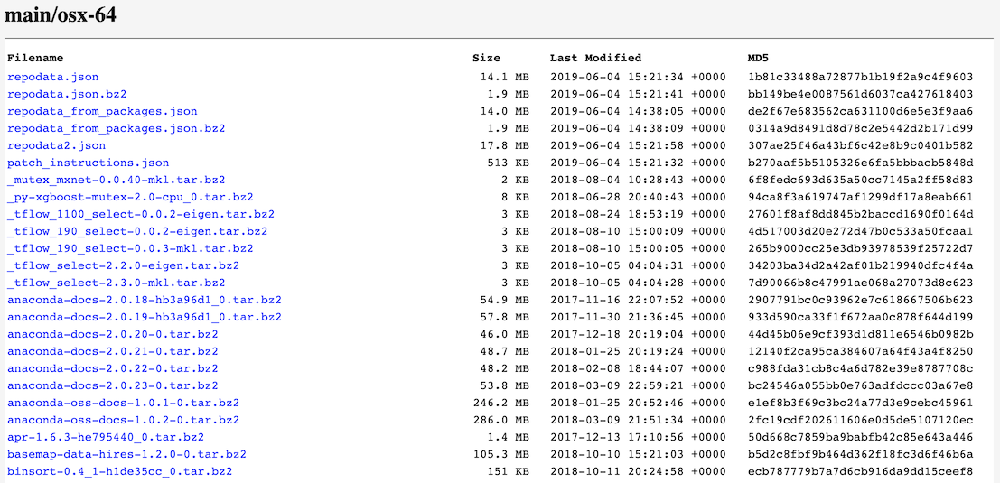
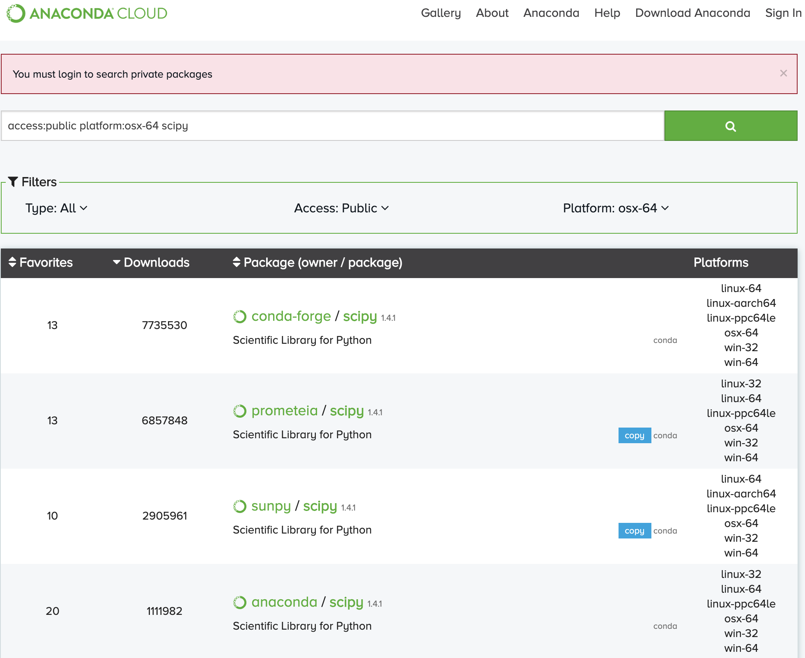

# Conda channels

Conda channels are the location where packages are stored, namely **repositories**. There are dozens (if not hundreds) of channels available each with their own collection of Python packages. Whenever you install a new package using conda, its contents will come from exactly one channel. By **default**, conda will only install from the defaults channel. You can verify that the defaults channel is the only one available by running the following command:

```console
(base)~$ conda config --show channels
channels:
    - defaults
```
All channels have at least one URL available where the repository is located, which are directories containing conda packages. You can find it with the following command:

```console
(base)~$ conda info  
```
The above command will show a bunch of information about conda installation and the URLS channel:

```console
  channel URLs: https://repo.anacona.com/pkgs/main/osx-64
  channel URLs: https://repo.anacona.com/pkgs/main/noarch
  channel URLs: https://repo.anacona.com/pkgs/r/osx-64
  channel URLs: https://repo.anacona.com/pkgs/r/noarch
```

The above results are from my macOS. Linux and Windows channel URLs will look very similar. Notice that there are multiple URLs for this one channel. There’s even a URL for R packages, which seems bizarre, but conda is not a tool just for managing Python packages. It is a general purpose package manager that can work with any other programming language.


### Anaconda repository

The packages are automatically downloaded and updated from [https://repo.anaconda.com/pkgs](https://repo.anaconda.com/pkgs/).

You can modify what remote channels are automatically searched. You might want to do this to maintain a private or internal channel. For details, see how to [modify your channel list](https://docs.conda.io/projects/conda/en/latest/user-guide/configuration/use-condarc.html#config-channels).

Navigating to the following URL [https://repo.anaconda.com/pkgs/main/osx-64/](https://repo.anaconda.com/pkgs/main/osx-64/), you will see a list of packages available to download from the default URL.



### Other conda repositories

The `default channel` contains a hand-picked list from the team at Anaconda of popular and powerful packages to do scientific computing. However, there are many thousands of packages that exist that are not available in the defaults channel.

If conda cannot find a package in the default channel, the installation will fail with an error message (`NOT FOUND ERROR`). You can specify a different channel to use as long as you know its name.

The easiest way to find the channel name of a package, that isn’t available from the default [Anaconda repository](https://repo.anaconda.com/pkgs/), is to visit [anaconda.org](https://anaconda.org/) and search for it on the top page. In this way, Users can search for alternate channels on [Anaconda Cloud](https://anaconda.org/), which hosts conda packages provided by third parties repositories such as **Conda-forge**.

Anaconda, the company, allows anyone to create a channel and will host these packages in the [Anaconda Cloud](https://anaconda.org/). You can create an account right now and start your own channel with your specific collection of packages. To read more about conda channels you can refer to the following [link](https://docs.conda.io/projects/conda/en/latest/user-guide/concepts/channels.html).

### Anaconda Cloud and Trusted resources

As mentioned earlier, **Anaconda Cloud** is a **package management service** that makes it easy to find, access, store and share public and private notebooks, environments, and conda and PyPI packages, and to keep up with updates made to the packages and environments you’re using (Ref. [doc](https://docs.continuum.io/anaconda-cloud/)). Anaconda Cloud is made up of channels/owners. Each channels contains one or more conda packages.

It is important to be careful when downloading any packages from an untrusted source. **Conda forge** is a reliable source for many popular python packages. It is wise to research about the source of a conda package.

### Conda forge channel

`Conda-forge` is the most popular channel outside of the defaults and contains many more [packages](https://conda-forge.org/feedstocks/).

Conda-forge is a community channel made up of thousands of contributors. Conda-forge itself is analogous to [PyPI](https://pypi.org/) but with a unified, automated build infrastructure and more peer review of recipes. You might encounter them quite often and they even have their own [website](https://conda-forge.org/), so installing packages from this channel is quite reliable.

For example, if you search a popular package such as `scipy` on [Anaconda Cloud](https://anaconda.org/) in the search results page you get the following table:



The results above show for this package the list of channels available in the `package(owner/package)` column. As you can see `Conda-forge` is the most popular with the largest number of downloads.

It's generally recommended to install packages only from `conda-forge` (if possible) and not from the defaults. The reasons for this are described in the `conda-forge` documentation.

One of the main reasons to use a single channel such as `conda-forge` **is the consistency it provides with package compatibility**. For packages that have components written in a compiled language like C, compatibility improves when they are all compiled from the same base C library.

### Preconfiguring Channels

If you have a few trusted channels that you prefer to use, you can pre-configure these so that everytime you are creating an environment, you won’t need to explicitly declare the channel.

```console
(base)~$ conda config --add channels conda-forge
```
